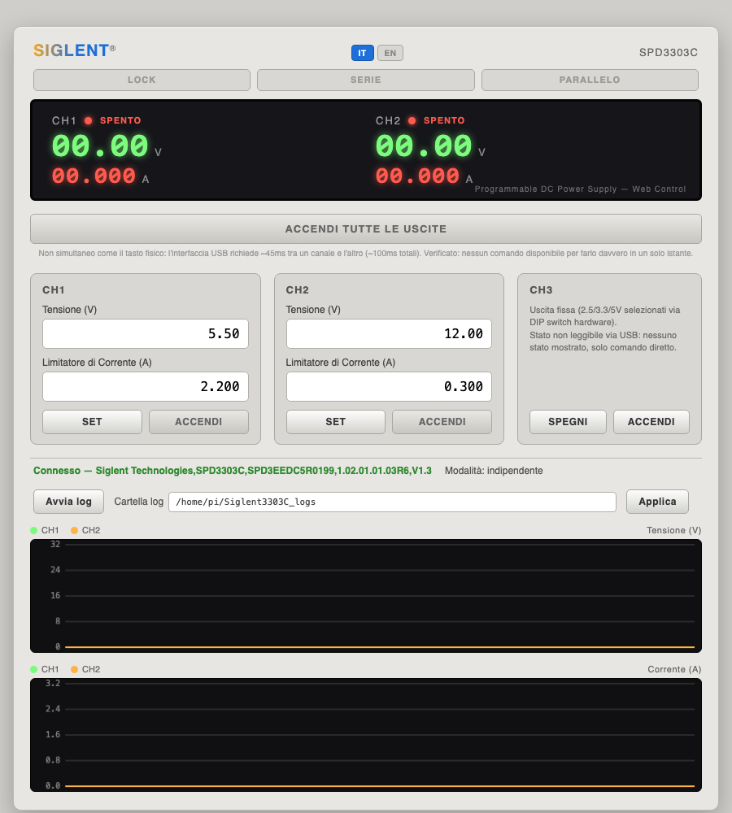

# Siglent3303C

🇬🇧 [English](README.md) | 🇮🇹 Italiano (questa pagina)

<p align="center"></p>

Interfaccia web per il controllo remoto via USB/SCPI dell'alimentatore
programmabile Siglent SPD3303C — monitoraggio in tempo reale, comando di
tensione/corrente, LOCK/SERIE/PARALLELO, data logging. Bilingue (IT/EN).

Lo SPD3303C espone comandi SCPI via USB (classe USBTMC): questa app parla
direttamente con lo strumento via `pyvisa`/`libusb`, senza bisogno di
NI-VISA né del software Windows-only fornito da Siglent (EasyPower).

<p align="center"></p>

## Installazione e avvio

Due modi per usarlo, entrambi mono-comando ed entrambi eseguono
esattamente lo stesso codice (`app.py`/`spd3303c.py`): nessuna differenza
di funzionalità o di correttezza tra i due, solo di comodità.

### Opzione A — Eseguibile standalone (nessun prerequisito)

Scarica il binario per la tua piattaforma dalla pagina delle
[release](../../releases) e lancialo:

```bash
chmod +x siglent3303c-<piattaforma>
./siglent3303c-<piattaforma>
```

Si apre da solo nel browser su `http://127.0.0.1:8420`.

**Linux**: la prima volta serve una regola udev per l'accesso USB senza
privilegi di root (altrimenti l'app segnala "nessun dispositivo trovato"
anche se lo strumento è collegato):

```bash
sudo cp udev/99-siglent-spd3303.rules /etc/udev/rules.d/
sudo udevadm control --reload-rules && sudo udevadm trigger
```

Poi scollega e ricollega l'alimentatore (o riavvia).

**macOS**: essendo un binario non firmato (nessun certificato Apple
Developer), Gatekeeper lo bloccherà al primo avvio. Nel Finder, tasto
destro sul file → "Apri" → confermare "Apri comunque" (una sola volta).

### Opzione B — Da sorgente (richiede solo Python 3)

Se hai già Python 3 installato, o vuoi leggere/modificare il codice, o
usi una piattaforma senza binario precompilato (es. ARM 32-bit):

```bash
./run.sh
```

Alla prima esecuzione crea da solo un virtualenv (`.venv`) e installa le
dipendenze da `requirements.txt`; alle volte successive le riusa e
riparte subito. Nessun altro prerequisito oltre a Python 3.

## Compilare il proprio eseguibile

```bash
./build.sh
```

Crea `dist/siglent3303c-<os>-<arch>`. PyInstaller non compila in modo
incrociato: va eseguito separatamente su ogni piattaforma di destinazione
(una volta su Mac per il binario Mac, una volta su Linux/Raspberry Pi per
quello Linux/ARM, ecc.). Su macOS richiede un Python compilato con
libreria condivisa (`--enable-shared`/`--enable-framework`) — quello di
Homebrew funziona, uno da pyenv spesso no.

## Note tecniche

- Il firmware non è pienamente conforme USBTMC: senza impostare
  esplicitamente `read_termination`/`write_termination = '\n'` su pyvisa,
  le query vanno in timeout; serve inoltre un delay minimo (~45ms) tra
  scrittura e lettura, altrimenti letture consecutive rischiano di
  desincronizzarsi (una risposta arrivata in ritardo viene letta dalla
  query successiva).
- Nessun comando SCPI esiste per comandare più canali contemporaneamente
  in modo davvero simultaneo (verificato: `*TRG` non è implementato,
  nessun'altra documentazione Siglent lo menziona) — il tasto fisico
  "tutte le uscite" dello strumento è realizzato solo in firmware.
- CH2 segue automaticamente i setpoint di CH1 in modalità Series/Parallel
  (verificato sull'hardware); CH3 (uscita fissa) non è leggibile via USB,
  solo comandabile in ON/OFF.
- Bit di stato non documentati nel manuale, scoperti empiricamente: lo
  stato di LOCK della tastiera compare come bit `0x0400` in
  `SYSTem:STATus?`.
