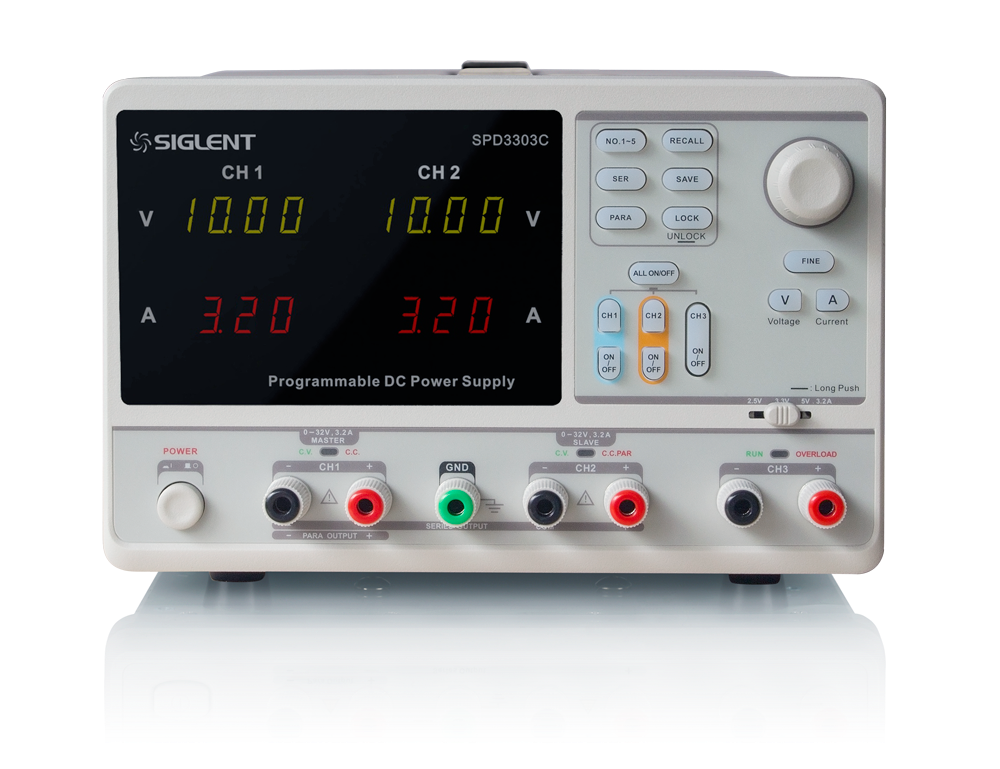
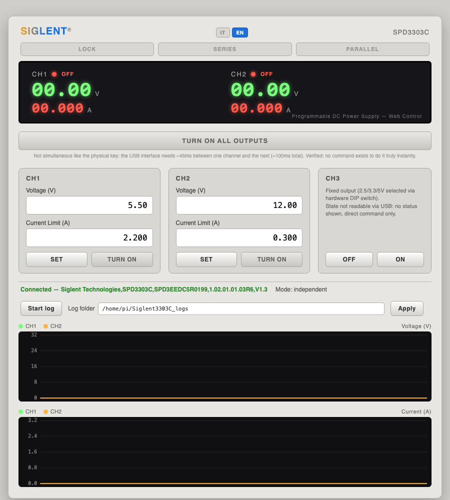

# Siglent3303C

🇬🇧 English (this page) | 🇮🇹 [Italiano](README.it.md)

<p align="center"></p>

Web interface for remote USB/SCPI control of the Siglent SPD3303C
programmable power supply — real-time monitoring, voltage/current
control, LOCK/SERIES/PARALLEL, data logging. Bilingual UI (IT/EN).

The SPD3303C exposes SCPI commands over USB (USBTMC class): this app
talks to the instrument directly via `pyvisa`/`libusb`, no need for
NI-VISA or the Windows-only software Siglent ships (EasyPower).

<p align="center"></p>

## Installation and startup

Two ways to use it, both single-command and both running exactly the
same code (`app.py`/`spd3303c.py`): no functional or correctness
difference between them, only convenience.

### Option A — Standalone executable (no prerequisites)

Download the binary for your platform from the
[releases](../../releases) page and run it:

```bash
chmod +x siglent3303c-<platform>
./siglent3303c-<platform>
```

It opens itself in the browser at `http://127.0.0.1:8420`.

**Linux**: the first time, you need a udev rule for USB access without
root privileges (otherwise the app reports "no device found" even
though the instrument is connected):

```bash
sudo cp udev/99-siglent-spd3303.rules /etc/udev/rules.d/
sudo udevadm control --reload-rules && sudo udevadm trigger
```

Then unplug and replug the power supply (or reboot).

**macOS**: since it's an unsigned binary (no Apple Developer
certificate), Gatekeeper will block it on first launch. In Finder,
right-click the file → "Open" → confirm "Open Anyway" (once).

### Option B — From source (requires only Python 3)

If you already have Python 3 installed, or want to read/modify the
code, or use a platform without a prebuilt binary (e.g. 32-bit ARM):

```bash
./run.sh
```

On first run it creates its own virtualenv (`.venv`) and installs
dependencies from `requirements.txt`; on later runs it reuses them and
starts right away. No prerequisite other than Python 3.

## Building your own executable

```bash
./build.sh
```

Creates `dist/siglent3303c-<os>-<arch>`. PyInstaller does not
cross-compile: it must be run separately on each target platform (once
on a Mac for the Mac binary, once on Linux/Raspberry Pi for the
Linux/ARM one, etc.). On macOS it requires a Python built with a shared
library (`--enable-shared`/`--enable-framework`) — Homebrew's Python
works, one from pyenv often doesn't.

## Technical notes

- The firmware isn't fully USBTMC-compliant: without explicitly setting
  `read_termination`/`write_termination = '\n'` on pyvisa, queries time
  out; a minimum delay (~45ms) between write and read is also needed,
  otherwise consecutive reads risk desyncing (a late response gets read
  by the next, unrelated query).
- No SCPI command exists to command multiple channels truly
  simultaneously (verified: `*TRG` isn't implemented, no other Siglent
  documentation mentions it) — the instrument's physical "all outputs"
  key is implemented in firmware only.
- CH2 automatically follows CH1's setpoints in Series/Parallel mode
  (verified on real hardware); CH3 (fixed output) isn't readable over
  USB, only commandable ON/OFF.
- Undocumented status bits discovered empirically: the keyboard LOCK
  state shows up as bit `0x0400` in `SYSTem:STATus?`.
